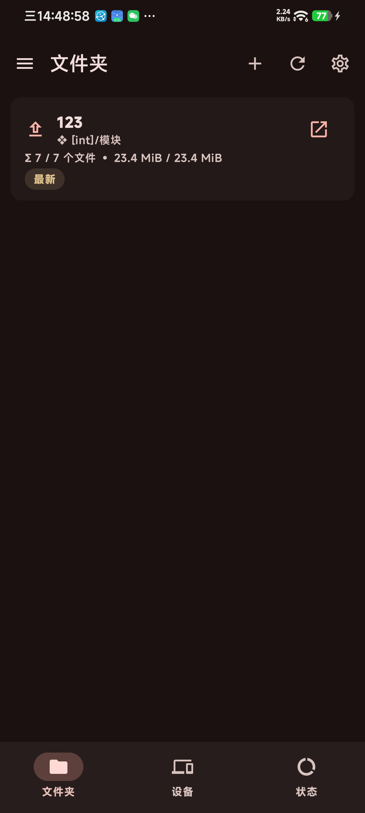
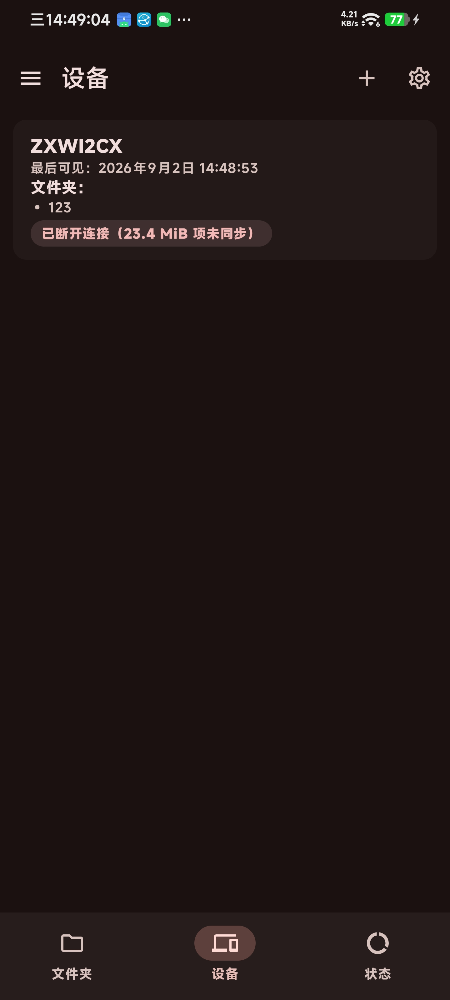
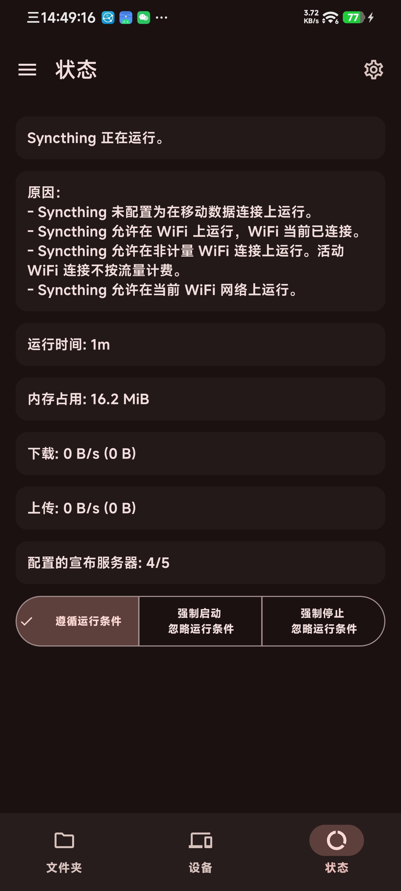

# Syncthing-Fork (Compose 版)

[English](README.md) | 简体中文

[](https://opensource.org/licenses/MPL-2.0)
[](https://github.com/100pangci/syncthing-android/actions/workflows/build-app.yaml)
[](https://github.com/100pangci/syncthing-android/releases/latest)

[Syncthing](https://github.com/syncthing/syncthing) 的 Android 封装。Syncthing 核心以 Go 编写，被交叉编译为原生库（`libsyncthingnative.so`）由前台服务托管运行，上层提供原生 Android 界面，无需 ROOT 即可在多台设备间私密、去中心化地同步文件。



## 本 Fork 的改动

在 [researchxxl/Syncthing-Fork](https://github.com/researchxxl/syncthing-android)的基础上完成的集中重构：

### 界面全面重构
- 旧 Java/View 界面整体重写为 **Jetpack Compose + Material 3**，采用单 Activity + **Navigation 3** 导航
- 文件夹 / 设备 / 状态三个页面迁移到底部导航栏
- 移除全部旧 View 遗留代码与资源

### 新特性
- **AMOLED 纯黑主题**：跟随系统 / 浅色 / 深色 / AMOLED 四档即时切换，同步内嵌 Web GUI 的 black 主题
- **全量本地化补全**：38 种语言全部补齐至 100%（每种含 496 键 + 8 组复数，其中 az / be / ckb / gl 为从零新建），所有语言文件的键顺序与主模板 `values/strings.xml` 完全对齐，便于后续维护
- 包名改为 `com.github.ywpc05.syncthingfork`，可与上游版本并存安装

### 稳定性与修复
- 同步核心稳定性重构：迁移到 NetworkCallback、拆分 Service 职责、修复配置 / 事件处理中的实际缺陷

### 工程化
- 为核心同步路径（事件处理、运行条件、配置解析）补充 Robolectric 单元测试
- CI 完整接管：自动构建 debug / release 并签名

### 目标

- **完全重写服务层**：目前服务层（`SyncthingService` / `RestApi` / `EventProcessor` / `RunConditionMonitor` / `ConfigXml` 等）仍是 Java，计划将其逐步迁移为 Kotlin + 协程 / Flow 的现代实现，与 Compose UI 层统一技术栈，最终移除 Java 代码与 Dagger 依赖注入。

## 下载

前往 [Releases](https://github.com/100pangci/syncthing-android/releases/latest) 下载 APK，或使用 [Obtainium](https://apps.obtainium.imranr.dev/redirect?r=obtainium%3A%2F%2Fapp%2F%7B%22id%22%3A%22com.github.ywpc05.syncthingfork%22%2C%22url%22%3A%22https%3A%2F%2Fgithub.com%2F100pangci%2Fsyncthing-android%22%2C%22author%22%3A%22100pangci%22%2C%22name%22%3A%22Syncthing-Fork%22%2C%22preferredApkIndex%22%3A0%2C%22additionalSettings%22%3A%22%7B%5C%22verifyLatestTag%5C%22%3Atrue%7D%22%2C%22overrideSource%22%3Anull%7D) 订阅更新。

> 应用包名为 `com.github.ywpc05.syncthingfork`（debug 构建带 `.debug` 后缀），与上游 `com.github.catfriend1.syncthingfork` 不冲突，可并存安装。从旧版本迁移数据请看[迁移指南](wiki/migration/Switching-from-the-deprecated-official-version.md)。

## 构建

```bash
# 1. 安装 SDK / NDK / Go 等前置依赖
python3 scripts/install_minimum_android_sdk_prerequisites.py

# 2. 交叉编译 Syncthing 原生库
./gradlew buildNative

# 3. 构建应用
./gradlew assembleDebug     # 或 assembleRelease
```

详细说明见 [Building and Development](wiki/developers/Building-and-Development.md)。CI 会自动构建 debug / release APK 并签名。

## 文档 / Wiki

知识库（常见问题、电池优化、厂商后台限制、故障排除等）见 [wiki](wiki#readme)。

## 技术栈

| 层 | 技术 |
|---|---|
| UI | Kotlin, Jetpack Compose, Material 3, Navigation 3 |
| 服务层 | Java（前台服务 / REST API / 事件处理 / 运行条件监视） |
| 同步核心 | Syncthing (Go, git submodule) → NDK 交叉编译，子进程方式运行 |
| DI / 数据 | Dagger 2 (KSP), Gson, Volley, SharedPreferences |
| 构建 | Gradle (Kotlin DSL) + Version Catalog, JDK 21, AGP 9.x |

- minSdk 23 (Android 6.0) / targetSdk 36 / compileSdk 37

## 致谢

- 上游 Fork 源：[researchxxl/syncthing-android](https://github.com/researchxxl/syncthing-android)
- 历史维护者：[Catfriend1](https://github.com/Catfriend1)、[imsodin](https://github.com/imsodin)、[nutomic](https://github.com/nutomic)
- [Syncthing](https://github.com/syncthing/syncthing) 核心团队

## 隐私政策

见 [privacy-policy.md](privacy-policy.md)。

## 许可证

[MPLv2](LICENSE)
